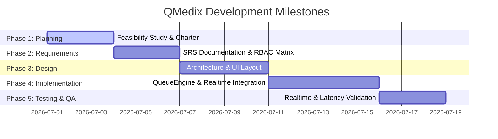

# SDLC Phase 1: Planning Document - QMedix Queue System

This document outlines the planning phase of the QMedix Smart Healthcare Appointment & Queue Management System.

---

## 1. Project Charter & Vision

### 1.1 Objective
To develop a high-performance, real-time healthcare queue management client system that eliminates waiting area friction by synchronizing walk-in patients and digital pre-booked slots.

### 1.2 Problem Statement
Traditional healthcare environments suffer from high patient waiting times, queue order confusion when emergency overrides occur, and lack of live updates. System complexity increases when patients, doctors, staff, and admins operate on disjointed state views.

### 1.3 Solution Vision
QMedix provides a role-based client dashboard linked to a unified state engine (`QueueEngine`), synced globally via Supabase Realtime postgres changes, guaranteeing low-latency state updates (under 2s) and static, universal token tracking.

---

## 2. Feasibility Study

### 2.1 Technical Feasibility
- **Framework**: React 19 + Vite 7 for highly responsive component lifecycle management.
- **Styling**: Tailwind CSS 4.0 for optimized clinical dark modes and fluid UI transition timings.
- **State Synchronization**: Centralized singleton class (`QueueEngine`) executing sorting/position algorithms locally in client memory.
- **Realtime**: Supabase Client SDK leveraging WebSocket subscriptions to avoid costly polling operations.

### 2.2 Operational Feasibility
- **Doctors**: Requires zero manual sorting. Single-click action calls the next patient.
- **Staff (Receptionists)**: Direct modal inputs for walk-in registration and emergency flagging.
- **Patients**: Clear live-status visualization containing static ticket values and active serving numbers.

---

## 3. Project Schedule & Milestones

---

## 4. Resource Allocation
- **Product Architect**: Designs queue and tokenization logic.
- **Frontend Engineer**: Builds dashboards, protected routes, and hooks.
- **QA Tester**: Evaluates simulated concurrency and WebSocket disconnect recovery.
